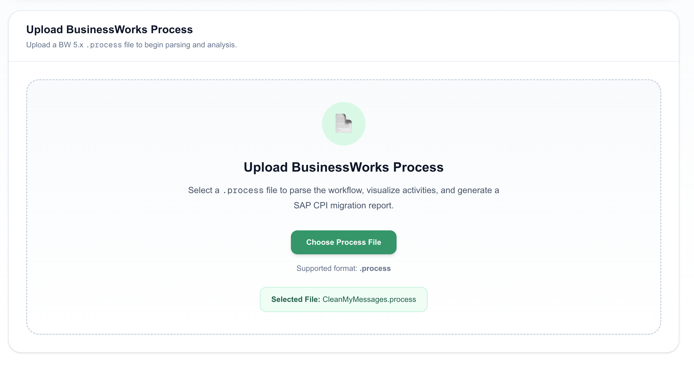
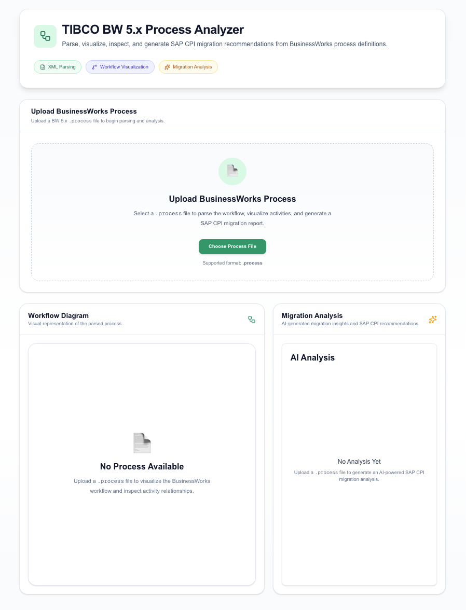

# 🚀 TIBCO BW 5.x Process Analyzer

A full-stack web application that parses **TIBCO BusinessWorks 5.x (`.process`)** XML files, visualizes integration workflows using **React Flow**, and generates AI-powered process analysis with **SAP Cloud Integration (SAP CPI)** migration recommendations.

Developed as part of a technical assessment to demonstrate XML parsing, workflow visualization, backend API development, and AI-assisted enterprise integration modernization.

---

# 📖 Overview

TIBCO BusinessWorks 5.x process definitions are stored as XML-based `.process` files. Understanding these workflows manually can be challenging, especially for large enterprise integrations.

This application streamlines that process by:

- Parsing BW 5.x `.process` files into a structured JSON representation
- Visualizing workflows as interactive process graphs
- Generating AI-powered summaries and complexity assessments
- Recommending SAP CPI migration strategies and integration patterns

The application follows a modular architecture with a clear separation between parsing, visualization, and AI analysis, making the codebase maintainable and extensible.

---

# ✨ Features

## 📂 Upload & Parse

Upload any valid **TIBCO BW 5.x (`.process`)** file and convert it into a structured JSON representation.

**Extracts:**
- Activities
- Groups
- Transitions
- Process Variables
- Error Handlers
- Process Metadata

---

## 📊 Workflow Visualization

Visualize parsed workflows using **React Flow** with:

- Interactive node-edge diagrams
- Zoom and pan support
- Start and End node highlighting
- Error path visualization
- Responsive workflow canvas

---

## 🤖 AI Process Analysis

Powered by **Google Gemini**, the application generates:

- Plain-English process summary
- Complexity assessment
- Complexity reasoning
- SAP CPI migration strategy
- Recommended migration steps
- Suggested SAP CPI adapters

---

## 🎨 Modern User Interface

- Responsive design
- Drag-and-drop file upload
- Interactive workflow visualization
- Dedicated AI analysis panel
- Clean and intuitive interface

---

# 🛠️ Tech Stack

| Frontend | Backend |
|----------|---------|
| Next.js | Node.js |
| React | Express.js |
| TypeScript | TypeScript |
| Tailwind CSS | Fast XML Parser |
| React Flow | Multer |
| Axios | Google Gemini API |
---

# 🏗️ Architecture

The application follows a simple pipeline from file upload to workflow visualization and AI-powered analysis.

```bash
                           ┌───────────────────────────┐            
                           │   Upload .process File    │
                           └─────────────┬─────────────┘
                                         │
                                         ▼
                           ┌───────────────────────────┐
                           │     Express Backend       │
                           └─────────────┬─────────────┘
                                         │
                                         ▼
                           ┌───────────────────────────┐
                           │     XML Process Parser    │
                           └─────────────┬─────────────┘
                                         │
                                         ▼
                      ┌─────────────────────────────────────┐
                      │ Structured JSON Process Model       │
                      └─────────────┬───────────┬───────────┘
                                    │           │
                         ┌──────────▼───┐   ┌───▼────────────┐
                         │ React Flow   │   │  Gemini AI     │
                         │ Visualization│   │    Analysis    │
                         └──────────────┘   └──────┬─────────┘
                                                   │
                                                   ▼
                              ┌─────────────────────────────────┐
                              │ • Process Summary               │
                              │ • Complexity Assessment         │
                              │ • SAP CPI Migration Strategy    │
                              │ • Recommended Adapters          │
                              └─────────────────────────────────┘
```

---

# 📁 Project Structure

```bash
tibco-process-analyzer/
│
├── backend/
│   ├── src/
│   │   ├── controllers/
│   │   ├── middleware/
│   │   ├── parser/
│   │   ├── routes/
│   │   ├── services/
│   │   ├── types/
│   │   ├── utils/
│   │   ├── app.ts
│   │   └── server.ts
│   │
│   ├── uploads/
│   ├── package.json
│   └── tsconfig.json
│
├── frontend/
│   ├── src/
│   │   ├── app/
│   │   ├── components/
│   │   ├── lib/
│   │   └── types/
│   │
│   ├── package.json
│   └── tsconfig.json
│
├── samples/
│
└── README.md
```

---

# ⚙️ Getting Started

## 1. Clone the Repository

```bash
git clone https://github.com/mohammadhashim135/tibco-process-analyzer.git
cd tibco-process-analyzer
```

## 2. Backend Setup

Navigate to the backend directory and install dependencies:

```bash
cd backend
npm install
```

Create a `.env` file:

```env
PORT=8000
GEMINI_API_KEY=YOUR_GEMINI_API_KEY
```

Start the backend server:

```bash
npm run dev
```

The backend will be available at:

```text
http://localhost:8000
```

---

## 3. Frontend Setup

Open a new terminal and run:

```bash
cd frontend
npm install
npm run dev
```

The frontend will be available at:

```text
http://localhost:3000
```

---

# 🔐 Environment Variables

| Variable | Description |
|----------|-------------|
| `PORT` | Backend server port |
| `GEMINI_API_KEY` | Google Gemini API key used for AI analysis |

---

# 🔌 API Endpoints

| Method | Endpoint | Description |
|--------|----------|-------------|
| `GET` | `/api/health` | Check server status |
| `POST` | `/api/process/upload` | Upload and parse a TIBCO BW 5.x `.process` file |
| `POST` | `/api/ai/analyze` | Generate AI-powered analysis from the parsed process |

## Health Check

```http
GET /api/health
```

**Response**

```json
{
  "success": true,
  "message": "Server is running"
}
```

---

## Upload Process

```http
POST /api/process/upload
```

**Request**

- `multipart/form-data`
- File (`.process`)

**Response**

Returns the parsed process as structured JSON.

---

## AI Analysis

```http
POST /api/ai/analyze
```

**Request**

- Structured process JSON

**Response**

```json
{
  "summary": "...",
  "complexity": "Medium",
  "reasoning": "...",
  "sapCpiDesign": "...",
  "migrationSteps": [],
  "recommendedAdapters": []
}
```

---


# 🔄 Workflow

The application processes a TIBCO BW 5.x `.process` file through the following stages:

1. Upload and validate the process file.
2. Parse the XML into a structured JSON model.
3. Visualize the workflow using React Flow.
4. Generate AI-powered insights using Google Gemini.
5. Display the workflow and analysis in the web interface.

---
# 🧪 Sample Process Files

The application was tested using publicly available **TIBCO BusinessWorks 5.x** process files, including:

- `MainProcess.process`
- `MainProcessStarter.process`
- `CleanMyMessages.process`

**Reference repositories:**

- https://github.com/tibcobwblog/tibcobwblog_samples
- https://github.com/hanneslehmann/tibco-bw5-template

---

# 💡 Design Decisions

### Structured Parsing Before AI

Rather than sending raw XML directly to the language model, the application first converts the process definition into a structured JSON representation.

**Benefits:**

- Reduced token usage
- Improved AI understanding
- Cleaner prompts
- Easier workflow visualization
- Clear separation between parsing and analysis
- Reusable parser output for future extensions

---

# Technology Choices

## React Flow

Chosen for its interactive workflow visualization capabilities, including:

- Node-edge graph rendering
- Zoom and pan support
- Extensible workflow components
- Excellent developer experience

## Google Gemini

Selected for AI analysis because it provides:

- Fast inference
- Reliable structured output generation
- Strong reasoning capabilities
- Developer-friendly free tier

---

# 📸 Screenshots

## Upload Process



## Workflow Visualization


## AI Analysis


## Complete Dashboard



---
# 🤝 **Contributing** 
Contributions are welcome! If you’d like to improve feel free to fork the repo and submit a pull request.

## **Steps to Contribute:**

## **1. Fork the repository**

## **2. Create a new branch:**

```bash
git checkout -b feature-branch
```

## **3. Make your changes and commit:**

```bash
git commit -m "Added new feature"
```
## **4. Push to the branch:**

```bash
git push origin feature-branch
```
## **5. Open a Pull Request**
---
# **License** 📜
This project is licensed under the MIT License.

💡 Developed with ❤️ by [Mohammad Hashim](https://github.com/mohammadhashim135)
